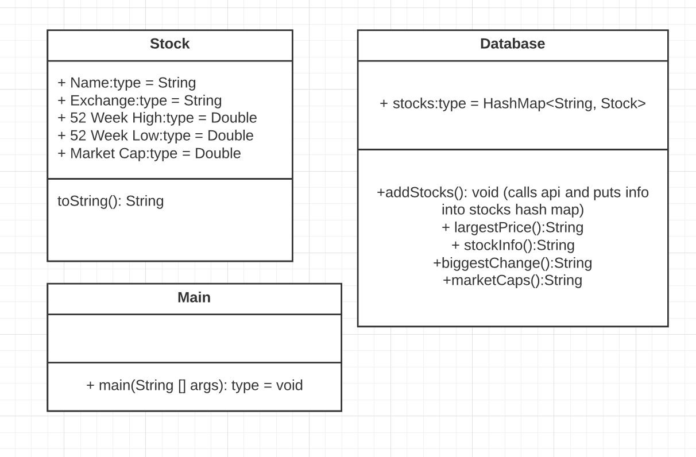

# November 19 Update
We created a UML diagram to plan the structure of the Java application and we started refactoring our old python code by creating 2 classes (Stock.java and Database.java).

## Possible Next Steps
We would need to create the methods that will retrieve relevant data from the stock information we have.
We could add some more methods too. Example: Top 10 Stocks
We could also create a GUI to make interaction with our application easier.
